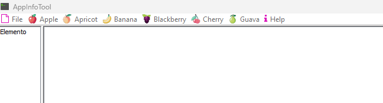

# AppInfoTool

## Descripci&#243;n general

### Nombre del Proyecto: Herramienta de Informaci&#243;n de Ayuda (AppInfoTool)

### Tecnolog&#237;as Utilizadas:

- **Lenguaje de Programaci&#243;n:** Java

- **Framework de Interfaz Gr&#225;fica:** Swing

- **Base de Datos:** SQLite

- **Seguridad:** BCrypt para el cifrado de contrase&#241;as

- **Archivos JSON:** Para la configuraci&#243;n de men&#250;s adicionales y temas informativos

- **Reportes:** JasperReports para la generaci&#243;n de informes

## Funcionalidades Principales

**1. Ventana de Login:**

- Al iniciar la aplicaci&#243;n, aparece una ventana de login donde los usuarios registrados pueden ingresar sus credenciales.

- Las contrase&#241;as se almacenan en la base de datos cifradas utilizando la librer&#237;a BCrypt para mayor seguridad.

**2. Gesti&#243;n de Men&#250;s:**

- La aplicaci&#243;n cuenta con men&#250;s fijos est&#225;ndar.

- Adicionalmente, se pueden agregar men&#250;s personalizados definidos en archivos JSON. La aplicaci&#243;n lee estos archivos al iniciar y agrega los men&#250;s de manera autom&#225;tica.

**3. Visualizaci&#243;n de Temas Informativos:**

- La aplicaci&#243;n muestra una lista de temas informativos en un JList ubicado en el lado izquierdo del JDesktopPane.

- Al seleccionar un tema en el JList, el contenido del tema se muestra en un JEditorPane ubicado en el lado derecho del JDesktopPane.

**4. Conexi&#243;n a Base de Datos:**

- La informaci&#243;n de los usuarios y los temas informativos se almacenan en una base de datos local SQLite.

- La aplicaci&#243;n se conecta a esta base de datos para manejar la autenticaci&#243;n de usuarios y la visualizaci&#243;n de los temas.

**5. Generaci&#243;n de Reportes:**

- La aplicaci&#243;n puede desplegar informaci&#243;n detallada utilizando JasperViewer de la librer&#237;a de JasperReports, permitiendo la generaci&#243;n y visualizaci&#243;n de informes personalizados.

> Este proyecto de aplicaci&#243;n de escritorio en Java con Swing es una herramienta robusta y flexible para la gesti&#243;n de informaci&#243;n de ayuda. La integraci&#243;n con una base de datos SQLite, el uso de BCrypt para la seguridad de las contrase&#241;as y la capacidad de generar informes con JasperReports lo hacen una soluci&#243;n completa y eficaz.

# Screenshots

