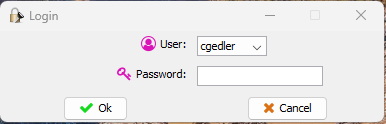

# AppInfoTool

## Overview

### Project Name: Help Information Tool (AppInfoTool)

### Technologies Used:

- **Programming Language:** Java

- **Graphical Interface Framework:** Swing

- **Database:** SQLite

- **Security:** BCrypt for password encryption

- **JSON files:** For configuring additional menus and informational topics

- **Reports:** JasperReports for generating reports

## Main Features

**1. Login Window:**

- When starting the application, a login window appears where registered users can enter their credentials.

- Passwords are stored in the database encrypted using the BCrypt library for greater security.

**2. Menu Management:**

- The application has standard fixed menus.

- Additionally, custom menus defined in JSON files can be added. The application reads these files at startup and adds the menus automatically.

**3. Viewing Informational Topics:**

- The application displays a list of informational topics in a JList located on the left side of the JDesktopPane.

- When you select a theme in the JList, the content of the theme is displayed in a JEditorPane located on the right side of the JDesktopPane.

**4. Database Connection:**

- User information and news topics are stored in a local SQLite database.

- The application connects to this database to handle user authentication and topic display.

**5. Report Generation:**

- The application can display detailed information using JasperViewer from the JasperReports library, allowing the generation and visualization of custom reports.

> This Java desktop application project with Swing is a robust and flexible tool for managing help information. Integration with an SQLite database, use of BCrypt for password security, and the ability to generate reports with JasperReports make it a complete and effective solution.

# Screenshots

